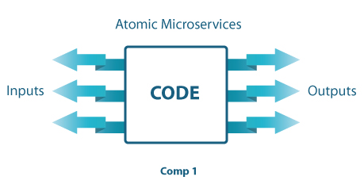
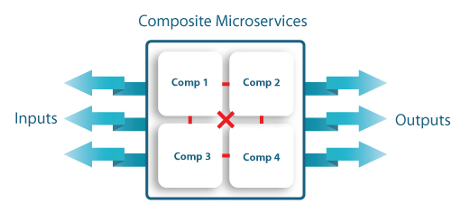

> 文章翻译自：[Microservices - The issue of Granularity: Atomic or Composite? ](https://www.fiorano.com/blogs/microservices)

在实现微服务架构时，服务的 "粒度" 一直是业界争论不休的话题。 分析师、开发人员和解决方案架构师仍在思考如何定义最合适的服务/组件规模。这种讨论通常以两个主要方案告终：

(在下面的讨论中，"服务/Service" 和 "组件/Component" 可以互换使用）。

1. 单级组件

2. 二级组件

## 单级 "原子" 组件

“原子”组件由单个代码 blob 以及一组定义的接口（输入和输出）组成。 在典型情况下，组件有几个（两个或三个）输入和输出。 每个原子组件的服务代码通常在单独的进程中运行。

## 两级 "组合" 组件

组合服务由单个 "外部/outer" 服务与一组接口组成。 此外部服务还包含一个或多个 "内部/inner" 组件，这些组件用于实现主外部组件。 默认情况下，组合服务在单独的进程中运行，而每个内部组件则在组合组件进程之外的单独线程中运行。 这种方法的支持者指出，通过将组合组件的实现组件化，可以获得更大的灵活性，并有更多机会在微服务实现中重复使用实现工件。

原子微服务非常简单。 它只是一个单一的代码块，使用你选择的编程语言。 根据底层微服务基础设施的不同，您可能需要自己实现一个线程模型，或者可以利用底层微服务框架的线程模型（例如，在基于 JMS 的微服务平台中，Sessions 提供单线程上下文）。 总体而言，原子微服务的开发复杂度相对较低，因为它是一个单一的逻辑模块。

相反，组合微服务对许多开发人员来说有着近乎浪漫的吸引力，他们对 "重复使用" 多个较小的内部组件来实现一个较大的单一组件的概念非常着迷。 遗憾的是，尽管这种方法在理论上是好的，但在实践中却有一些缺点。 对于初学者来说，执行模型很复杂，因为底层框架必须能够识别构成单个组合组件的内部组件的单独线程上下文。 这将带来巨大的性能开销，并使平台框架复杂化。 作为参考，在 2000 年代初，流行的 BPEL（业务流程执行语言）就采用了这种方法，但在实践中被证明是非常笨重的。 组合组件的另一个问题是没有简单的部署模型；因为组合组件与原子组件不同，更难以作为代理在网络上自动部署。

根据我们的经验，只要服务作为独立进程运行，原子组件就是微服务项目实施的更好选择。

