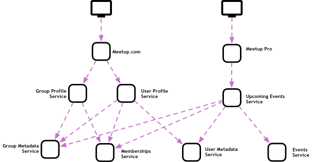
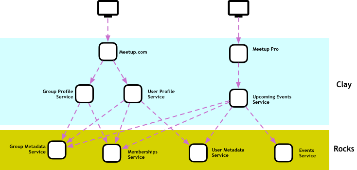
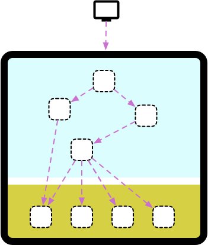
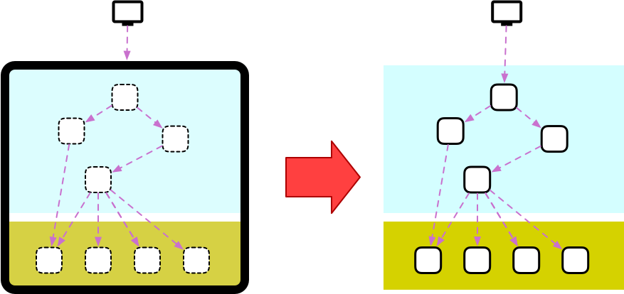
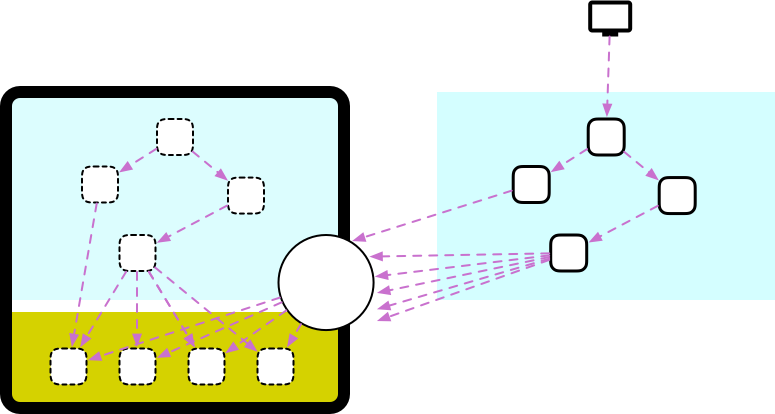
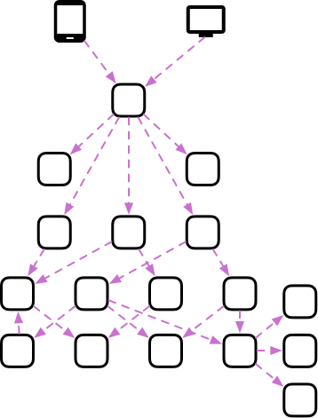
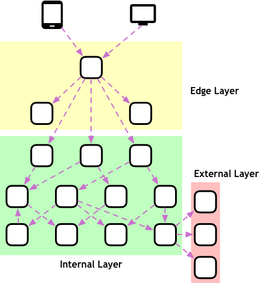
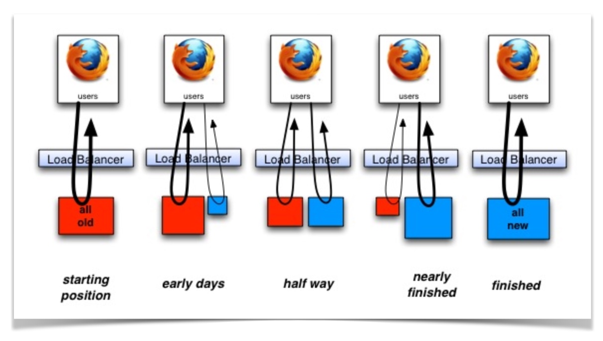
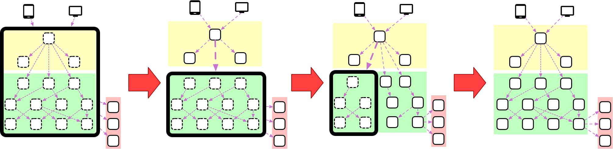

> 内容翻译自：[Layering Microservices](https://philcalcado.com/2018/09/24/services_layers.html)

在 [Meetup](https://www.meetup.com/)上，我们正在经历将单体系统拆分成微服务的 *哦，好熟悉的* 路径。 [这方面的工作几年前就开始了](http://making.meetup.com/post/140389877512/futurizing-meetup)，在我们采取任何进一步措施之前，团队已经确保了大部分 [微服务的先决条件](https://philcalcado.com/2017/06/11/calcados_microservices_prerequisites.html)。 今年夏天，我加入了这个团队，帮助规划和实施架构变革，这是将我们提升到一个新水平所必需的。

在这个过程中，软件架构的一个方面在我们的日常工作中是不变的，那就是使用 *Layers* 来组织我们的组件。 分层是一种在微服务方面讨论较少的技术。 在本文中，我想回顾一下分层模式在服务架构中的应用，并讨论两种分层策略，以及它们在我从单体架构迁移到微服务架构的过程中是如何发挥基础作用的。

## 面向服务架构（Soa）中的分层

我认为，分层是软件架构中最有用的工具之一。 它们有助于对组件进行分组，并定义组件之间的依赖关系和通信链。

Frank Buschmann 和他的合作者在 1996 年出版的开创性著作 [Pattern-Oriented Software Architecture, Volume 1](https://amzn.to/2NPqjGK)中，对软件中的分层进行了最全面的描述（据我所知）。 但甚至在此之前， [Meilir Page-Jones 就曾用这个概念](https://amzn.to/2wK7aQa) 来描述面向对象的运行时，不过他用 *domains* 这个词来指代每一层。 我特别喜欢使用 Martin Fowler 在其著作 [Patterns of Enterprise Application Architecture](https://amzn.to/2D8vdh9)中对分层的描述：

> 从层次的角度来考虑一个系统时，你会想象软件中的主要子系统被排列成某种形式的分层蛋糕，每一层都依托于下一层。 在这种方案中，上层使用下层定义的各种服务，但下层并不知道上层的情况。 此外，每一层通常都会向上层隐藏其下层，因此第 4 层使用第 3 层的服务，而第 3 层使用第 2 层的服务，但第 4 层并不知道第 2 层。 (并不是所有的分层架构都像这样不透明，但大多数都是不透明的，或者说大部分都是不透明的）。

然后，层是堆叠在一起的组件分组。 *组件* 这个词是一个占位符，代表你正在使用的任何抽象单元，如类、函数、服务等。

分层模式最著名的实现方式可能是网络堆栈，包括其最流行的实现方式 TCP/IP。 这种选择通常被认为是 TCP/IP 灵活性和长寿的原因，[使其能够以最初设计时未曾预见的方式进行扩展](https://philcalcado.com/2017/08/03/pattern_service_mesh.html)。

如果分层是将组件分组和堆叠，那么在分组组件时使用什么标准仍然是个问题。 事实上，Fowler在上文引用的同一本书中说：

> […] 分层架构中最艰难的部分是决定有哪些层以及每一层的责任。

考虑到我们对服务的关注，人们可以根据他们使用的技术栈、预期的可用性或许多其他标准来组合层中的组件。 即使在工程组织内部，不同的团队（如基础设施、应用安全、应用开发、成本管理等）也可能会根据他们更感兴趣的特征对这些分组采取不同的方法。

因此，将服务聚合到 "分层" 的组合是无限的。 单个分层模型是否足以了解架构的方方面面，这一点值得怀疑，因为每个分层模型都侧重于一个特定的视角。 您将使用分层模型组合来管理复杂的架构。

在构建了几个微服务架构后，我发现有两种分层方案对理解和管理这种高度分布式的架构非常有价值。 它们的适用范围非常广泛，因此我将它们称为架构模式。

## 模式：粘土-岩石分层模型

即使在具有类似可靠性或安全性特征的服务（例如，执行业务逻辑的服务）中，我们也会发现它们在许多其他重要方面并不完全相同。

让我们以 Meetup 的工作为基础，举一个虚构的例子。 在我们的主要消费者网站 [Meetup.com](htpps://meetup.com)上，有许多不同的用户流。 让我们重点关注用户在查看个人资料时所接触到的功能。 他们可能会查看自己的用户资料或在活动中遇到的某个人。 他们还可能会查看某个群组的简介，看看他们是否能提供用户感兴趣的体验。

在复杂的微服务架构中，上述每个流程通常都有自己的以用户案例为中心的微服务，反过来又会调用拥有组、用户、事件等数据的下级微服务。

然而，消费者网站并不是用户与我们互动的唯一途径。 为了让 [Google](https://www.meetup.com/pro/gdg) 或 [DigitalOcean](https://www.meetup.com/pro/digitalocean) 等品牌和企业能够在全球范围内组织多个聚会，我们提供了一款名为 [Meetup Pro](https://www.meetup.com/pro/)的产品。 专业版用户的一个常见用例是了解各组的活动计划。 它本身也被构建为一个微服务，可以访问一些较低级别的服务。

在这种情况下，我们有一些服务是用例驱动型的，提供的数据几乎与用户在屏幕上看到的内容一一对应，而有一些服务则更加 *raw*，这意味着其数据需要经过处理、过滤和汇总，才能以有意义的方式呈现给用户。

当我们从这个角度审视服务时，就会发现用户案例驱动或原始服务的程度与工程师在产品生命周期中对服务进行更改的频率之间存在着密切的关联。 自加入 Facebook 或 Twitter 等社交网络以来，您看到过多少次这些网络的用户资料页面改头换面？ 与一年前相比，它们现在肯定大不一样了。 但是，仔细想想，实际数据有多少次发生过重大变化，比如 Facebook 实施 "实名制" 政策，或者 Twitter 对某些个人资料进行 "验证"？

在产品开发过程中，软件越接近客户，其变化就越频繁。 产品经理和营销人员希望改善体验，每隔几个月就需要对设计进行更新，而且大部分实验都是在堆栈顶部的服务中进行的。 与其他服务相比，它们自然会经历更多的 *churn/搅乳器* ，这就为我们提供了一个优化这一层组件的机会，以适应快节奏的变化。

而图中底部的组件则不会经常变化。 当然，在某些时候，有人会给某个分组或某个用户添加以前没有的属性，但这通常是 *大事情*，会带有谨慎的变更管理和从以前状态到新状态的迁移策略。

这种两极分化足以证明分层模式的合理性。 我喜欢把这个 *称为 "粘土到岩石 "*：

在这个模型中，我们根据服务变化的频率对其进行分组。 *Clay* 是一个昵称，指的是那些预计会经常变化的软件，通常是由于现代软件产品需要不断变化才能保持其相关性。 这一层的软件并不脆弱或不可靠，但构建软件的人员通常会优先考虑迭代速度，而不是性能或弹性。

*Rocks* 是我们对实现多种不同用例的底层软件的称呼，这种软件与核心业务非常接近，可能只有在业务模式发生变化时才会改变。 许多其他服务都依赖于这一层的服务，这意味着在构建和维护这些服务时应考虑到其弹性和性能。

服务通常以 *clay* 的形式诞生，因为团队正在试验新产品和新功能。 如果实验发现了产品/市场契合点，随着越来越多的新产品和新功能开始建立在它们的基础上，它们通常会被下移。

### 从单体迁移到微服务时

承认 *岩石* 和 *粘土* 之间的差异，是我参与过的大多数成功迁移项目的共同特点。 当企业发展到需要考虑拆分单体的阶段时，通常会拥有稳定的核心产品，但发现很难快速迭代新功能或进行新实验。 在大多数情况下，这与 *粘土* 和 *岩石* 如何共享一个系统--单体有关。

在这种情况下，开发周期的速度会很慢，因为即使是对 *粘土* 层功能的最小改动，也会在不经意间影响到其中一个 *岩石* ，从而导致整个系统瘫痪。 代码审查、手动测试、缓慢推出以及许多其他变更管理技术都需要添加到流程中，这使得反馈周期越来越长。

对于处于这一阶段的组织来说，组织工程团队围绕着 "拆分单体"、从单体中提取服务这一重大任务开展工作是非常常见的。 原则上，该计划看起来很简单：

遗憾的是，我从未见过这样的努力能够顺利进行。 如何我们处理的只是提取 *粘土* 服务，事情通常都会很顺利。 事实上，这一层的逻辑往往非常单薄，与用户体验的耦合度也很低，因此往往只需进行一次漂亮的用户体验刷新就可以重写这些逻辑。

当人们试图提取 *岩石*时，真正的问题就暴露出来了。 这些系统不仅有更严格的非功能性要求，而且还有许多其他子系统依赖于它们，如果不重写半个单体，几乎不可能移除其中一个系统。

我比较成功的一种方法，也是 Twitter 或 SoundCloud 等经典的单体到微服务案例所采用的方法，就是专注于提取 *clay* 对象，而不是一开始就考虑 *rocks*。 你应该做的是在内部公开这些对象，建立一种有时被称为 *后门 API 的东西*。

有了这样的方法，我们就能在不断迭代产品的同时，长期提取 *rocks*。 通常的情况是，你从未真正摆脱过单体，但随着时间的推移，单体在关键路径中的作用会越来越小，因为团队要么提取了对象，要么业务需要改变，而新的领域从一开始就是以微服务的形式实现的。

## 模式：边缘-内部-外部分层模型

在可视化分布式应用程序架构时，一个重要的视角就是能够根据服务在网络中的位置来放置服务。

大多数架构都会有以下模式的变体：

用户通过网页、移动应用程序或API等方式与应用程序进行交互，将为您的服务带来入站流量。 无论您需要多少服务来完成手头的任务，用户的请求通常只涉及一项服务。 这项服务通常被称为 *API Gateway*，它负责确定要调用众多微服务中的哪一个来响应这一特定请求。

从上图中可能看不清楚的一点是，API 网关通常会将自己的一些职责委托给其他组件。 除非您想构建一个单体的API，否则用户验证、地理位置、速率限制和 A/B 测试等问题都应该是独立的服务。

这些辅助服务与典型的微服务有许多有趣的不同之处。 它们不仅不执行与核心业务直接相关的应用逻辑，而且往往对可用性和可扩展性有更严格的要求。 这些组件的另一个共同特点是，它们处理来自外部世界的数据，并需要在将数据转发给内部服务之前对其进行清理。 这意味着他们必须应用相当多的 *防御性编程*。

由于这些服务的要求比较严格，因此对它们进行更改往往需要更谨慎的程序--例如，在部署对这些关键路径系统的修改之前，你可能需要执行性能测试；在更改身份验证逻辑之前，你可能需要进行安全审计。 您可能需要一种更复杂的方法来部署这一层的变更，也许是蓝绿部署，因为这里的任何停机都会导致整个产品离线。 所有这一切都使得这一级组件的开发周期比其他服务慢，因为发生影响广泛的事件的风险更高。

虽然对于这些特殊情况的组件来说，开销是合理的，但我们绝对不希望常规微服务的运行速度如此缓慢。 帮助组织了解哪些组件要求更严格，哪些组件是通常的快速演进组件的一种方法是采用分层方案，我喜欢将其称为 *Edge-Internal-External*：

在这个模型中，我们将上述服务明确建模为我所说的 *Edge* 层。 它们是接收用户请求的入口点，并负责将用户请求安全地转化为架构内的请求。

然后，我们在 *内部/internal* 层提供服务。 这些将是您的绝大多数微服务，它们可以对其客户端和环境做出更多假设，包括这些请求已被清理、具有用于分布式跟踪的元数据等。

*External* 层也有一些服务。 这些服务是我们的系统与之对话的服务，但并非由我们开发或以我们可以控制的方式部署，通常是第三方服务。

边缘层本身可以有多种不同的实现方式。 有几家供应商提供 *一体化* 选项，让人们可以完全外包这项工作，如 API Gateways 或 Service Meshes 等产品。 规模更大或要求更复杂的组织可能希望自己构建和拥有 Edge 架构的至少一部分。 如果他们不满意市场上现有产品的单一性，并希望在该层应用微服务架构，情况就更是如此。

鉴于该层组件的重点是可用性和性能，拥有该层组件的团队通常不是产品工程团队，而是 *平台* 或 *基础设施*。

### 从单体迁移到微服务时

与 [Clay-to-Rocks Layering Model](https://philcalcado.com/2018/09/03/services_strata.html#Clay-to-Rocks)相似，Edge-Internal-External 模型所使用的标准与根据组件的难易程度对其进行分组有一定的关联。 也就是说，边缘层通常需要更严格的变更管理，类似于其他模型中的 *rocks*。 然而，这些模式并不相同，它们之间存在一些微妙而根本的区别。

从单体架构迁移到微服务架构时就会出现这种差异。 粘土-岩石模型建议您将 *岩石*留在单体内 ，时间越长越好。 不过，在 "边缘-内部-外部 "分层方案中，我们将边缘作为一个高杠杆点，这意味着在这里所做的微小努力就能使整个系统得到巨大改善。

在使用边缘技术推动组织摒弃单体系统时，一种非常流行的方法是使用 Strangler 模式，该模式最早由 [Martin Fowler 编目 ](https://www.martinfowler.com/bliki/StranglerApplication.html) ，并在 [一篇开创性文章（和图表](https://paulhammant.com/2013/07/14/legacy-application-strangulation-case-studies/) 中作了更详细的描述，作者是 Paul Hammant：

扼杀器的基本概念是在用户和传统系统之间放置一个中间件。 起初，中间件会将收到的所有请求重定向到原有系统，并将响应返回给用户。 然后，您就可以逐步编写传统子系统的替换程序，并将其部署到生产中。 中间件很聪明，它能将指向该子系统的流量重定向到新实施（通常是通过检查请求的 URL），同时仍将所有其他流量重定向到传统系统。 最终，越来越多的子系统被编写出来，新版本取代了整个传统应用程序。

在我们的 "边缘-内部-外部" 模型中，"边缘" 层为这种扼杀点提供了一个直观的位置。 微服务迁移的一种普遍方法是从单体中移除这一层开始。 在这个阶段，你不仅可以在不改变任何客户端应用程序的情况下，慢慢地从单体中提取逻辑到自己的微服务中。

这种策略的另一个优势是，您还可以确保任何新功能都已作为微服务实现，并且仍然可以访问重要功能，如身份验证和缓存。 根据我的经验，在采用微服务等大型重构工作中，最大的挑战是确保一个团队从单体中提取逻辑时，不会有其他团队添加进去。 这种模式为您提供了一种清理旧系统的方法，同时又不会妨碍人们开发新功能。

## 管理复杂性的复杂性

软件架构的大部分工作都是为了控制复杂性。 分层可以很好地抑制系统中的熵，但有时团队会爱上这种模式，并开始过度使用。 在使用图层时，我建议您首先应用一些简单的模型，如上图。 在我看来，任何超过三层或四层的模型都是不好的--也许你是想把两个不同的分层模型捆绑在一起？

使用架构模式的另一个方面是确保所有工程师都能理解其中的 *why* 和 *how*。 如果你的团队不了解你的层级，他们要么会完全忽略你的层级，要么会花大量时间争论某项服务应该放在 X 层还是 Y 层，这与你在 Confluence 页面上埋了多少花哨的图表无关。

与企业架构中的其他工具一样，层只有在简单易懂时才有用。2s
