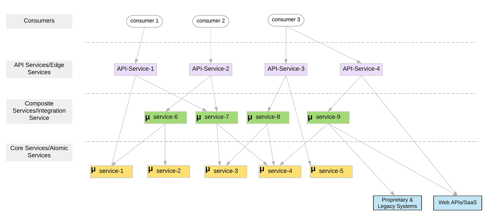

> 文章翻译自：[Microservices Layered Architecture](https://medium.com/microservices-in-practice/microservices-layered-architecture-88a7fc38d3f1)

使用微服务架构，单个软件应用程序/功能作为多个微服务及其交互的组合实现。 因此，服务之间的通信及其协调对于成功实现微服务架构至关重要。

重要的是要理解，ESB 在基于 ESB 的 SOA 实现中执行的任务不会在切换到微服务架构时简单地消失。 相反，所有 ESB/集成功能都被隔离并分散在所有微服务中。 因此，在实现服务时，基于微服务的粒度和功能对微服务的某种程度的逻辑组织非常有用。

因此，如果我们仔细研究微服务实现，我们可以识别不同类型的服务，我们可以将其分类为几个不同的层。 我们可以提出如图 1 所示的分层架构（我最初 [提出的](https://www.slideshare.net/kasun04/integration-microservices) 是一组逻辑层，但这也可以是一个具体的分层架构），其中包含不同的微服务类型。

图 1：微服务分层架构

因此，根据服务的功能和粒度，我们可以识别以下服务类别。

## 1. 核心/原子微服务

在底层，我们有细粒度的自包含服务（不依赖外部服务），主要包括业务逻辑和较少或没有网络通信逻辑。

## 2. 组合/集成微服务

原子微服务通常无法直接映射到业务功能，因为它们过于细粒度。 因此，特定的业务功能可能需要多个原子/核心服务的组合。 中间层由此类组合或集成微服务组成。 这些服务通常必须支持 ESB 的大部分功能，如路由、转换、协调、弹性和稳定性模式等。

组合/集成服务是粗粒度的（相对于原子服务而言），相互独立，包含业务逻辑（路由、调用哪些服务、如何进行数据类型映射等）和网络通信逻辑（通过各种协议进行服务间通信、熔断器等弹性行为）。

> 大多数 ESB/集成功能（如 EIP、弹性和稳定性模式）都是在组合/集成服务层的微服务架构中实现的。

这些服务还可以连接其他传统和专有系统（如 SAP ERP）、外部网络 API（如 Salesforce）、共享数据库等（通常称为 [反腐败（anti-corruption）层](https://docs.microsoft.com/en-us/azure/architecture/patterns/anti-corruption-layer)）。

## 3. API 服务/边缘服务

您将使用 API 服务/边缘服务将一组选定的组合服务甚至某些原子服务公开为托管 API。这些服务是一种特殊类型的组合服务，它应用基本路由功能、API 版本控制、API 安全模式、限流、运用货币化、创建 API 组合等。

## 构建微服务的技术

说到微服务的实现，目前大多数微服务实现都是任意使用一个给定的框架或一种编程语言来构建微服务，而没有考虑到不同的服务类型。 随着服务数量的激增，这将导致设计、实现和可扩展性方面的噩梦。 因此，我们需要根据正在开发的微服务的性质来选择合适的技术。

- **核心/原子服务**：大多数现有技术都侧重于构建这些服务。 有许多框架/库可用于构建此类服务（如 SpringBoot、Dropwizard、WSO2 MSF4J）。

- **组合/集成服务**：目前大多数微服务实现都试图使用同一套技术来构建核心/原子服务和组合/集成服务。 然而，大多数微服务框架和平台都不是为构建组合服务而设计的。

因此，在实现微服务架构的过程中，构建复合服务正成为最具挑战性的任务（试想一下使用 Java 或其他类似编程语言从头开始实现各种集成模式的工作量）。

为了解决这个问题，出现了一些新兴技术，如 [Ballerina](https://ballerinalang.org/)（这是一种专为服务组合和网络交互而设计的编程语言）和 [Service Mesh 框架](https://istio.io/) （有了 "Service Mesh"，您就可以将网络通信卸载到服务网格上，我们就可以只关注业务逻辑了。 例如， 调用其他服务时，无需担心断路。

**API/边缘服务：** 大多数现有的（单体）API 管理和网关解决方案都可以促进这些服务，只要 API 服务包含最少的业务逻辑即可。 然而，大多数微服务实现都试图将大量业务逻辑放入这一层，同时将其保持为单一的单体。 这不是一种可持续的架构，也违反了微服务的关键原则。 因此，有两种可能的方法来解决这个问题。

1. 将组合卸载到组合层，并可以使用单体网关仅将它们公开为 API。
2. 分离 API Gateway 运行时（微网关概念），以便独立构建和管理每个 API/edge 服务。

我们用于构建组合服务的技术同样可以用于API接口/边缘服务的开发。 因此，大多数现有的（单体）API 管理/网关解决方案仍在不断发展，以支持微网关等概念。

