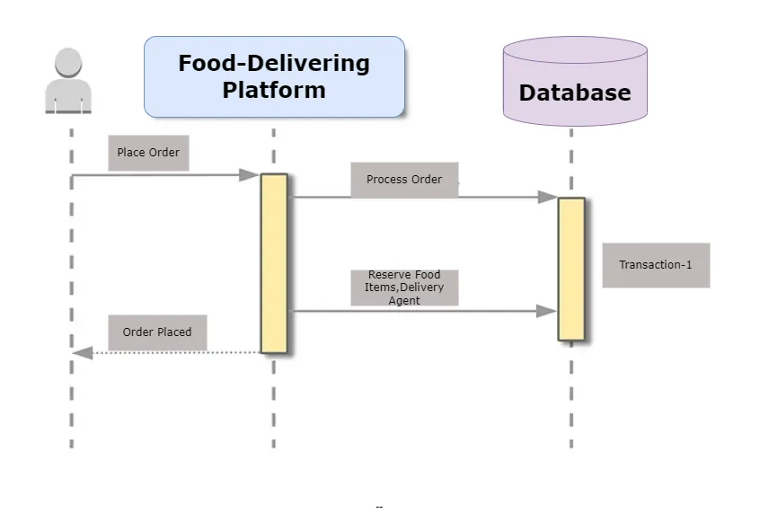
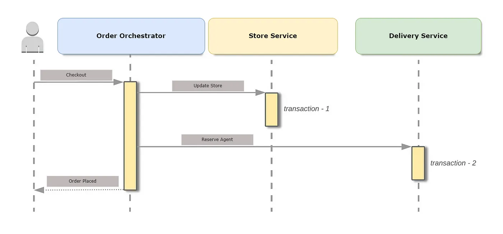
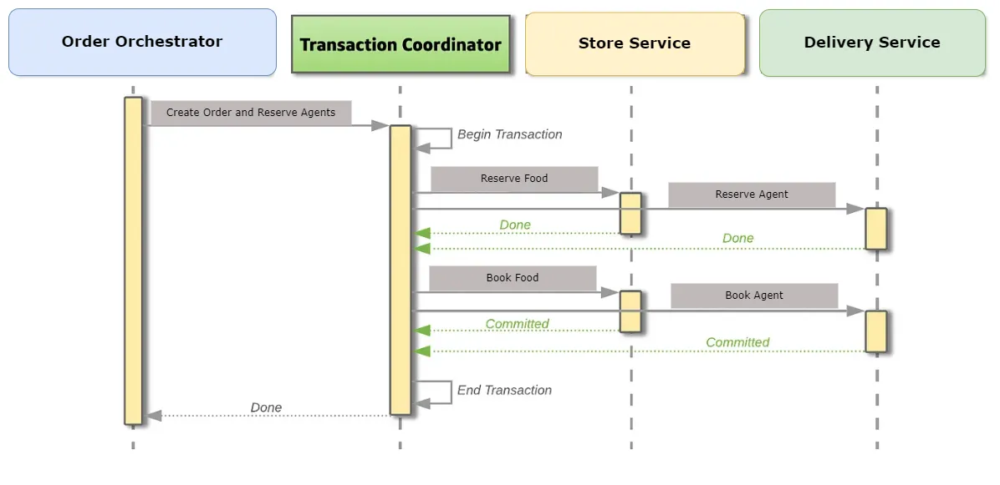
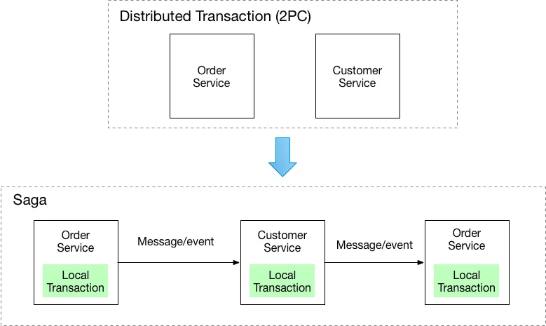
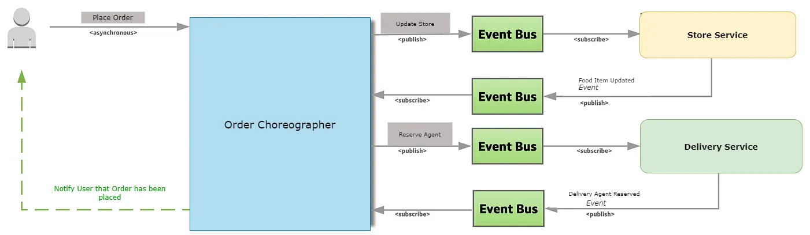
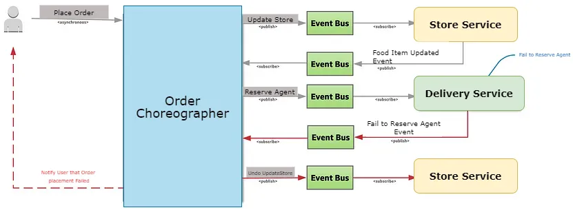

> 内容翻译自： [Handling Distributed Transactions In Microservices](https://blog.bitsrc.io/distributed-transactions-in-microservices-d07aba281f90)

对于每服务模式的数据库，如何在实现分布式事务时处理 ACID 属性。 处理这些的不同模式是什么？

送餐订单处理

## 什么是事务？

事务指的是以连贯可靠的方式在 DBMS 表上执行的一个工作单元，它独立于其他事务。 事务一般代表数据库中的任何变化。

## 什么是分布式事务？

跨越多个物理系统或网络计算机的事务被简单地称为分布式事务。 在微服务的世界里，事务现在被分配给多个服务，这些服务按顺序被调用来完成整个事务。

## 示例用例

### 10 分钟送餐平台

一家食品配送合作伙伴正试图推出一项 10 分钟食品配送服务，同时确保后台的两个主要组成部分/参与方，它们是：

1. 食品必须在附近的商店/选定的商店有售。

2. 送货员应能在 10 分钟内送达物品。

10分钟送餐订单的多项服务变更

当我们分解这个系统时，我们创建了微服务 **Store Service** 和 **Delivery Service** ，它们拥有独立的数据库。 当用户发出 **Place Order** 请求时，这两个微服务都会被调用，将更改应用到各自的数据库中。 由于事务现在是通过多个系统跨多个数据库进行的，因此现在被视为**分布式事务处理**。

## 与分布式事务有关的问题

向微服务架构的转变导致数据库的 ACID 属性丢失。 涉及多个微服务和数据库的事务可能会带来重大挑战，包括：

### 我们如何保持事务的原子性？

**原子性** 是指在一个事务中，要么完成所有步骤，要么不完成任何步骤。 在上面的示例中，如果 **Delivery Service** 方法中的 "Delivery Service" 失败，我们如何回滚 **Store Service** 应用的 "Update store" 更改？

### 如何处理并发请求？

如果任何一个微服务的对象正在被持久化到数据库中，而与此同时，另一个请求正在读取同一个对象。

**服务应该返回旧数据还是新数据？**

在上面的示例中，一旦 **Store Service** 完成，**Delivery Service** 现在正在执行更新，那么对客户所下订单数量的请求是否应包括当前订单？

### 解决上述问题的方法

上述问题对于创建和开发微服务应用程序至关重要。 可以采用以下策略来解决这些问题：

1. **两阶段提交。**
2. **最终一致性和补偿或 SAGA。**

## 1. 两阶段提交（2PC）

**2PC** 顾名思义，它分两个阶段处理交易，即 **prepare** 阶段和 **commit** 阶段。 它以单个原子单元的形式执行一组分布式事务。 他们有一个事务协调器，用于维护事务的生命周期。

### 工作方式

在 **prepare** 阶段，参与事务的每个服务都要投票决定提交或中止事务。 如果所有服务都投票决定提交事务，那么事务就会进入 **commit** 阶段，在这个阶段，所有参与事务的服务都会收到执行事务的通知。 事务协调器还可能向所有微服务发出回滚命令。

**让我们以 10 分钟送餐系统为例：**

用于设计分布式事务订单管理的 2PC 方法

在上述示例中，当用户发送 **Place Order** 请求时，**TransactionCoordinator** 将首先启动一个包含所有相关上下文数据的全局事务。 要预订食物，它首先会向 **Store Service** 发送 prepare 命令。 为了预留送货员，它将向 **Delivery Service** 发送 prepare 命令。 当两个服务都同意更改可以完成时，它们会锁定对象以防止任何其他更改并提醒事务协调器。 然后，事务协调者会在确定每个微服务都准备好应用其更改后，通过请求提交事务来要求每个微服务持久化其更改。

### 两阶段提交的问题3

系统确认 prepare 命令后，需要确保在收到 commit 命令时能够提交事务。 这意味着，在该系统收到 commit 或 abort 命令之前，不允许更改任何内容。

确保这一点的唯一方法是锁定您在事务中更改的所有信息。 只要该锁处于激活状态，其他事务就无法使用该信息。 这些锁会成为拖慢系统运行速度的瓶颈，显然应该避免。

在分布式单体应用程序中也存在这个问题。 但是，由于微服务的范围较小，而且经常要部署大量服务，因此情况变得更糟。

事务协调器和 2 个外部系统之间的 2 阶段提交已经够糟糕的了。 但是，每增加一个参与事务的外部系统，所需锁的复杂性和对性能的影响就会增加。

### 优势

- 2PC 保证交易的原子性。 事务结束时，要么所有微服务都成功了，要么所有微服务都没有任何变化。
- 它确保了对象的隔离，在事务协调器提交更改之前，对象上的更改是不可见的。
- 该方法是同步调用，其中客户端将收到成功或失败的通知。

### 缺点

- **高延迟任务** -2PC 事务与单个服务上的事务相比非常慢。 它们高度依赖于事务协调器，而事务协调器在高负载时确实会减慢系统运行速度。
- 锁可能会成为性能瓶颈，也有可能出现死锁，即两个事务相互锁定。

## 2. 最终一致性和补偿 / SAGA

根据 microservices.io，最终一致性意味着：

"*每个服务在更新其数据时都会发布一个事件。 其他服务订阅事件。 收到事件时，服务会更新其数据"。*

来源：microservice.io

### 工作方式

在这种方法中，每个业务事务都作为 saga 实现。 Saga 是一系列本地事务。 在每个本地事务中，相关的微服务都会更新其数据库，并发布消息或事件，以触发 saga 中的下一个本地事务。 如果本地事务因违反业务规则而失败，则 saga 将执行一系列补偿事务，这些事务撤消前面的本地事务所做的更改。

有两种协调 saga 的方法：

- **编排/Choreography ** - 每个本地事务都会发布领域事件，从而触发其他服务中的本地事务。
- **协调/Orchestration ** - 协调器（对象）告诉参与者要执行哪些本地事务。

**让我们以 10 分钟送餐系统为例：**

处理在一个事务中涉及多个服务的 SAGA 模式

在上图中，客户要求系统 *下订单* 。

根据这一请求，编排器会发出一个 **Update Store** 事件，标志着事务的开始。 存储服务会监听该事件并更新食品库存，如果更新成功，就会发出**Food Item Updated**事件。 编排者监听此事件，并通过发出 **Reserve Agent** 事件继续保留送货员。

派送服务会监听该事件并保留送货员，如果成功，则会发出 **Delivery Agent Reserved** 事件。 在此示例中，这意味着事务结束。

微服务之间所有基于事件的通信都通过事件总线进行，并由另一个系统进行编排，以解决复杂性问题。

Saga 模式的失败情景

如果 **Delivery Service** 因任何原因未能预订送货员，可能有多种原因，如没有可用的送货员、所有送货员都很忙、下单的地点现在无法提供服务，所有这些都取决于业务逻辑。 它会发出 **Failed to Reserve Agent** 事件。 编排器监听该事件，并通过发出 **Undo UpdateStore** 事件启动 **Compensating Transaction**。 储存服务会监听该事件，并删除所做的与食品项目相关的更改。

### 好处

- 它能让应用程序在不使用分布式事务的情况下，在多个服务之间保持数据一致性。
- 没有死锁。
- 高可扩展性。

### 缺点

- 编程模式更为复杂。 例如，开发人员必须设计补偿事务，明确撤消 SAGA 中先前所做的更改。
- 没有对最终用户的读取隔离。 不过，根据该架构中的业务需求，也有一些方法可以处理这种情况。

> 虽然不是每个基于微服务的架构的灵丹妙药，但使用开源工具链通常是有益的，例如 [**Bit**](https://bit.cloud/) 将微服务分解为可重用的模块化组件，这些组件可用于多个 Saga 或事务。 这有助于降低部分复杂性，减少代码重复，简化测试和维护。
>
> 此外，Bit 还提供了一个集中式平台，用于 [**管理和共享这些组件**](https://bit.dev/blog/-extracting-and-reusing-pre-existing-components-using-bit-add-l28qlxpz/)**。** 这可以大大简化 SAGA 的编程模型，减少设计补偿交易的复杂性和工作量。 了解更多信息 [**这里**](https://bit.dev/reference/docs/docs-overview/).

## 结论

在构建单体架构时，尽量避免使用分布式事务。 如果我们需要在两个地方进行更改或使用跨服务的事务，那么与两阶段提交相比，最终一致性/SAGA 技术是处理分布式事务的更好方法，因为它可以在一个事件导致需要在两个地方更改数据时使用。 最终一致性方法还引入了一系列新问题，例如如何原子性的更新数据库并发出事件。

## 参考资料

1. https://thorben-janssen.com/distributed-transactions-microservices/#:~:text=In%20a%20microservice%20architecture%2C%20a,choreographed%20SAGAs%20avoid%20these%20problems.
2. www.microservices.io
