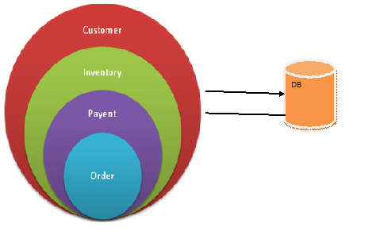
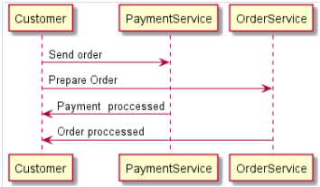
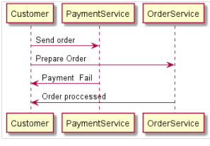
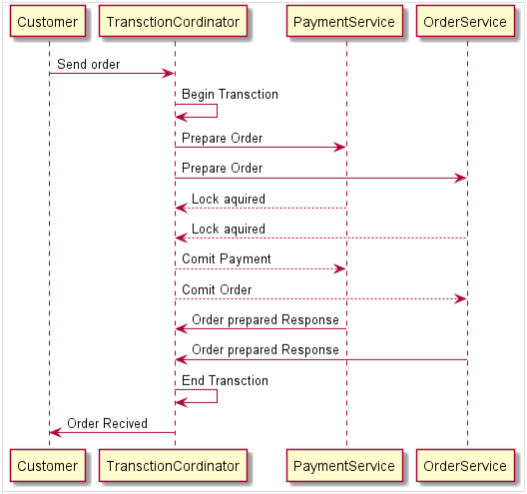
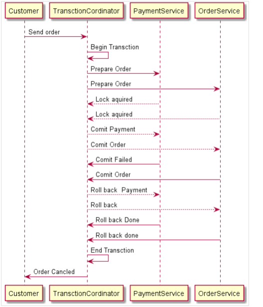
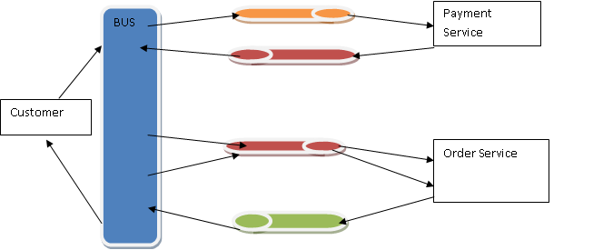

> 内容翻译自：[Handing distributed Atomic transactions in Microservice](https://www.linkedin.com/pulse/handing-distributed-atomic-transactions-microservicehanding-distributed-atomic-transactions-microservice-abhilash-ranjan)

让我们先了解一下事务。 在计算机编程中，事务通常指一连串的信息交换和相关工作（如 [数据库](https://searchsqlserver.techtarget.com/definition/database) 更新），为了满足请求和确保数据库的完整性，这些工作被视为一个单元。 要完成事务并永久更改数据库，必须完整地完成事务。

事务可以通过两种锁定方式实现。

1. 乐观锁（检查版本）

2. 悲观锁（整个对象和行锁）

## 什么是分布式交易？

通过网络环境跨越多个系统或计算机的事务。 目前，微服务使用分布式事务。

事务处理在编程中是一个复杂的过程，但我们可以通过应用单体架构中的一些模式轻松实现。 当我们把这种架构细分为微服务时，真正的问题就从事务开始了。

单体 E-Com 应用

现在，将应用程序分解为微型服务，我们必须考虑应用程序的 12 个因素，除此以外，我们首先要解决的几个设计问题或重要问题包括:

-  对应用程序进行建模，以拆分微服务，如将大型 ECOM 划分为多个微服务。
-  每个微服务处理其本地事务，并将其上下文传递给其他调用。
-  处理分布式事务。 

这里我们有两种方法

- 2 阶段锁

- Saga 事务

## 分布式事务的问题

让我们了解一下普通的 Ecom 应用程序，在该程序中，客户发送订单请求，有两个服务，一个是 **PaymentService** ，另一个是 **OrderService**。  因此，事务请求被发送到两个服务，然后每个服务将提交其本地事务并完成订单服务。 如果失败，我们就没有办法恢复事务。 从微服务模式开始，我们通过两阶段锁定来解决这个问题。 我们知道，任何解决方案都不是完美无缺的，也不是灵丹妙药。 我们将进一步讨论两阶段锁及其问题，以及 saga 方法及其问题。

## 如何在微服务中执行原子事务？

### 2 阶段锁

关于 2 阶段锁的序列图是不言自明的。  客户向 **TransctionCordinator** （Coordinator **micorservice** ）发送订单请求，该协调器通过发送准备订单，在名为支付服务和订单服务的另一项服务之间进行协调。 服务发送消息锁后，事务服务发送提交，一旦提交过程完成，服务发送消息命令准备完成响应并结束事务。

到目前为止，一切正常，只是出现了轻微的故障情况和回滚。 下图为失败情景。 除了 **TransctionCordinator** 发送信息提交付款失败时，锁仍未释放，付款服务发送信息提交失败外，一切都将与正常情景完全相同。 因此， **Cordiantor** 向两个服务发送消息，回滚所有本地事务并释放锁。 此时事务提交失败或回滚。

在上述情况下，我们可以处理原子事务。 一切正常，我们可以进行原子事务处理，回滚过程中的问题出在哪里？

我肯定会想到一件事，如果锁从未打开过，而且假设有数百万个请求，那该怎么办？ 是的，会出现死锁情况。 另外，每个事务的速度也会变慢。

## 现在，我们该如何克服这个问题呢？

还有一种方法是 **SAGA** ，它是在 microroservice.io 中定义的，通过企业服务总线或队列或 Redis 缓存来处理事件。 我将在下一篇文章中解释 redis 的队列模型。

在这种方法中，分布式事务通过在总线或队列中传递消息和更新事件来异步处理。

我们可以这样理解：客户发送订单请求后，会有一条中间件总线首先将信息发送到支付服务和订单服务，然后在绿色阴影队列中等待它们的响应。 一旦这两项服务都返回，信息订单就会得到确认。

### 考虑故障场景

客服人员将在总线上发送订购请求。 总线将向支付服务队列和订单服务队列发送请求，并等待它们的响应。 如果支付服务失败（红色队列），则总线服务将向订单服务发送另一个请求，请求回滚或删除订单（红色队列），然后删除订单。

 **这种方法可以处理数百万个请求，但众所周知，任何方法都不是万能的。 这也有一些缺点**

1. Saga 模式没有读隔离。 例如，客户可以看到正在创建的订单，但在下一秒，由于补偿事务，订单被删除。

2. Saga 模式很难调试，尤其是在涉及许多微服务时。 此外，如果系统变得复杂，事件消息可能会变得难以维护

为了结束这个话题， **Saga** 模式是解决基于微服务架构的分布式事务问题的首选方法。 但是，它也引入了一组新的问题，例如如何以原子方式更新数据库并发出事件。 采用 Saga 模式需要改变开发和测试的思维方式。

