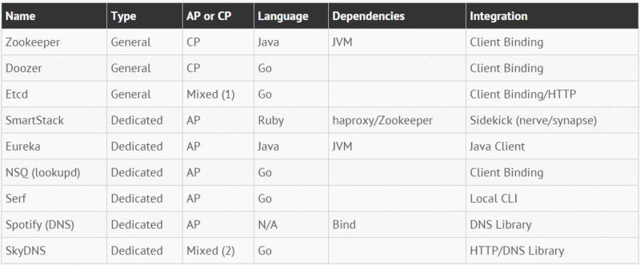

# 服务注册/发现

## 强一致性存储

- [Zookeeper](http://zookeeper.apache.org/)

	来自 Apache，以Java语言编写，强一致性(CP), 使用 Zab 协议 (基于PAXOS)。

    郑重提醒：使用zookeeper时，不要直接使用zk的Java api，**请尽量使用  Curator **！

- [Doozer](https://github.com/ha/doozer)

	doozerd 的 Go 语言客户端，强一致性，使用 PAXOS 协议。

    这是一个很多年前就存在的项目，已经停滞很久，有大量的fork。

	个人建议：没有特殊理由，不要选择。

- [Etcd](https://github.com/coreos/etcd)

	据说是受 zookeeper 和 Doozer 启发，用 Go 语言编写，使用 Raft 协议。

    etcd 2.* 版本提供 HTTP+JSON 的 API，而最新的 etcd 3.0 版本修改为 gRPC，效率大为提升。

- [Consul](https://www.consul.io/)

	来自 hashicorp 公司，和 etcd 一样也是基于 Raft 协议。

    Consul 最大的优势，是提供可以直接使用的成品，如服务注册，健康检查，配置等，相比之下 zk，etcd 等更像是提供原材料。

- [SmartStack](http://nerds.airbnb.com/smartstack-service-discovery-cloud/)

	来自 Airbnb，由 [Nerve](https://github.com/airbnb/nerve) 和 [Synapse](https://github.com/airbnb/synapse) 两个部分组成，依赖zookeeper和haproxy。用 Ruby 语言编写

- [Eureka](https://github.com/Netflix/eureka)

	来自 Netflix， 服务器端和客户端都是用 Java 语言编写，因此只能用于Java和基于JVM的语言。

- [NSQ]()

	来自 Bitly， Go 语言编写。

- [Serf](http://serfdom.io/)

	Go 语言编写,采用的是基于 gossip 的 SWIM 协议。

主要的一致性协议有：

- PAXOS： Zookeeper
- Raft： Consul / Etcd

## 弱一致性存储

也有不是很介意分布式一致性，而采用自行实现的简单方案：

- 新浪微博 Vintage

	基于redis。

	用于新浪的 Motan 框架："Motan 可以支持不同的注册中心，如 ZK、Consul，目前使用的注册中心是平台开发的 Vintage，Vintage 是一个基于 Redis 的轻量级 KV 存储系统，能够提供命名空间服务、服务注册、服务订阅等功能。"。

    > 注：已经和 Tim Yang 老师确认，目前的确还是如此。

## DNS相关

- Spotify 和 DNS
- [SkyDNS](https://github.com/skynetservices/skydns)
- consul提供的DNS

## 内建服务注册的框架

服务注册是任何一个SOA/服务化/微服务框架的必不可少的一个部分，因此很多框架都内建了对服务注册的支持：

- dubbo：支持注册中心扩展，支持多个实现
- motan：提供对 Zookeeper 和 Consul 的支持
- Spring Cloud： 提供子项目如Spring Cloud Consul/Spring Cloud Zookeeper

## 参考资料

- [Open-Source Service Discovery](http://jasonwilder.com/blog/2014/02/04/service-discovery-in-the-cloud/)
- [Service Discovery in a Microservices Architecture](https://www.nginx.com/blog/service-discovery-in-a-microservices-architecture/)
- [服务发现方案梳理及NetflixEureka简介](https://segmentfault.com/a/1190000004944218)