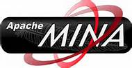

# 网络类库

## NIO 框架

目前Java的 NIO 类库的选择很多，但是社区使用比较多也比较推荐的是 Netty 。

### 如日中天的 Netty

- http://netty.io/

Netty是由JBOSS提供的一个java开源框架。Netty提供异步的、事件驱动的网络应用程序框架和工具，用以快速开发高性能、高可靠性的网络服务器和客户端程序。

是目前最流行的 NIO 方案，最新版本 4.1, 主要提供了对 HTTP/2 的支持。

特别提醒： **Netty 5.* 已经被废弃！**

- 具体的说明请见：https://github.com/netty/netty/issues/4466
- 主要理由是: 使用 ForkJoinPool 的主要改动增加了复杂度但是并没有显示出明确的性能收益。(原文：The major change of using a ForkJoinPool increases complexity and has not
demonstrated a clear performance benefit.)
- 因此目前 Netty 官方已经放弃了 netty 5.× 版本的开发和更新，并且推荐已经使用 netty 5.× alpha版本的同学退回到 4.0或者4.1版本

### 英雄迟暮的 Mina

- http://mina.apache.org/

Apache Mina是一个能够帮助用户开发高性能和高伸缩性网络应用程序的框架。它通过Java nio技术基于TCP/IP和UDP/IP协议提供了抽象的、事件驱动的、异步的API。

传闻说 mina 已经很少更新，但是看最近(2016年9月)又连续发布了 2.0.14/2.0.15 两个版本。

个人建议：如果没有特殊原因，在 netty 和 mina 之间推荐选择 netty。

> 注: Netty和Mina是Java社区知名的通讯框架，出自同一个作者: 韩国人 Trustin Lee 。Mina略早，属于Apache基金会，而Netty开始在Jboss名下，后来出来自立门户netty.io。

### 鲜为人知的 XNIO

- https://github.com/xnio/xnio

XNIO 是一个鲜为人知的 Java NIO 类库，由 Jboss/Redhat 提供，主要是用在 Jboss/Redhat 自家的Web 服务器 Undertow 上。

XNIO 最新版本 3.4.0.Final，发布于2016年8月。

Undertow 是一个采用 Java 开发的灵活的高性能 Web 服务器，提供包括阻塞和基于 NIO 的非堵塞机制。Undertow 是 Jboss/Redhat 公司的开源产品，是 Wildfly 默认的 Web 服务器。

Undertow 比较有意思的特性是它"**特别轻量**"：Undertow core jar 不到1M，运行时简单的内嵌服务器使用不到4M的堆空间。

另外，Undertow 居然也提供了对HTTP2的支持。

## HTTP 类库

### 支持Android的 Okhttp

- http://square.github.io/okhttp/

An HTTP & HTTP/2 client for Android and Java applications

亮点：

1. 支持 HTTP/2
2. 支持 Android

