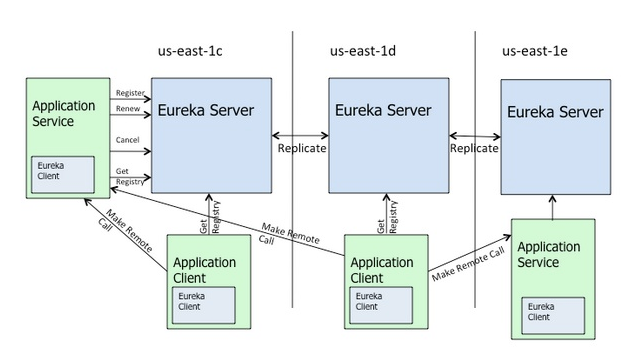

# Eureka

## 介绍

- [eureka源码 @ github](https://github.com/Netflix/eureka)
- [eureka wiki](https://github.com/Netflix/eureka/wiki)

按照官方介绍：

> Eureka is a REST (Representational State Transfer) based service that is primarily used in the AWS cloud for locating services for the purpose of load balancing and failover of middle-tier servers.
>
> Eureka 是一个基于 REST 的服务，主要在 AWS 云中使用, 定位服务来进行中间层服务器的负载均衡和故障转移。

## 分析

### 工作方式

Eureka 提供服务注册与服务发现功能：

Eureka 是一个 RESTful 服务，使用 REST 进行通讯。

Eureka 用来定位运行在AWS地区中的中间层服务。由两个组件组成：

1. Eureka服务器：Eureka服务器用作服务注册服务器。
2. Eureka客户端：

	Eureka客户端是一个java客户端，用来简化与服务器的交互、作为轮询负载均衡器，并提供服务的故障切换支持。
    > 注：Netflix 在其生产环境中使用的是另外的客户端，它提供基于流量、资源利用率以及出错状态的加权负载均衡。
