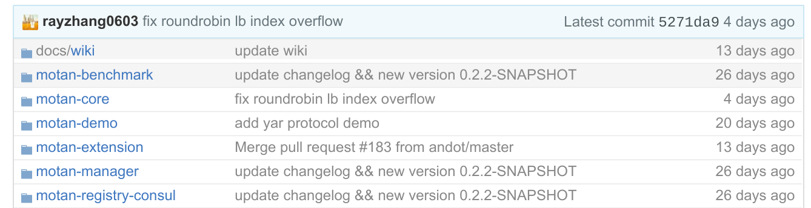

# Motan

## 介绍

Motan 是微博在2016年8月开源的用于高性能分布式服务快速开发的 RPC 框架, 但是也兼具基本的服务化框架的功能。

Motan偏重于简洁实用的服务治理功能和优秀的RPC协议扩展能力，既可以提供高效的RPC远程调用，又能提供服务发现、服务高可用（High Available）、负载均衡、服务监控、管理等服务治理功能。通过SPI机制提供强大的扩展能力，可以支持不同的RPC协议、传输协议。Motan能够无缝支持Spring配置方式使用RPC服务，通过简单、灵活的配置就可以提供或使用RPC服务。通过使用Motan框架，可以十分方便的进行服务拆分、分布式服务部署。

- [Motan源码 @ github](https://github.com/weibocom/motan/)

微博解释他们开发 Motan 而不是使用 dubbo 的原因：

> Dubbo 功能上比较丰富，但当时我们想要一个比较轻量的 RPC 框架，方便我们做一些适合自己业务场景的改造和功能 feature，以达到内部业务平滑改造和迁移的目的。这种情况下，在 dubbo 上改的成本可能比重新写一套更高。最终我们决定开发 motan RPC。

## 分析

### 更新情况

Motan 相比 dubbo，就如同活力四射的少年一般，充满生机和活力，这是 github 上的更新情况：

当然，年轻也意味着可能不够成熟，在稳定性和可能出现的问题尚待检验。

> 注：我们曾经在Motan开源的第一天就下载下来研究，结果 helloworold 都没有跑起来，直接 NullPointException，里面代码让人哭笑不得，大意是: `if (a == null) {a.dosomething()}`

### 功能

功能上，对比成熟而完善的 dubbo， motan 的功能还嫌单薄，不过 motan 本来也声称是轻量级 RPC 框架，定位不同，情有可原。Motan的解释：

> 与同类型的 Dubbo 相比，Motan 在功能方面并没有那么全面，也没有实现特别多的扩展，但 Motan 是一个小而精的 RPC 框架，它的特点是简单、易用，是一个不断向着实用、易用方向发展的 RPC 服务框架。

Motan 提供的主要功能包括：

- 服务发现 ：服务发布、订阅、通知
- 高可用策略 ：失败重试（Failover）、快速失败（Failfast）、异常隔离（Server 连续失败超过指定次数置为不可用，然后定期进行心跳探测）
- 负载均衡 ：支持低并发优先、一致性 Hash、随机请求、轮询等
- 扩展性 ：支持 SPI 扩展（service provider interface）
- 其他 ：调用统计、访问日志等

Motan 功能特点：**简单、易用、高可用**

- 无侵入集成、简单易用，通过 Spring 配置方式，无需额外代码即可集成分布式调用能力。
- 集成服务发现和服务治理能力，灵活支持多种配置管理组件，如 Consul、ZooKeeper 等。
- 支持自定义动态负载均衡、跨机房流量调整等高级服务调度能力。
- 基于高并发、高负载场景优化，具备 Failover、Failfast 能力，保障 RPC 服务高可用。

### 技术栈

微博的Motan RPC服务，底层通讯引擎采用了Netty网络框架，序列化协议支持 Hessian2 和Java序列化，通讯协议支持Motan、http、tcp、mc等。

Motan 除了支持常见的 zookeeper 之外，还支持使用 consul 作为注册中心。

### 应用场景

在应用方面，目前主要是微博自己大量使用，考虑到微博平台的超大规模，应该说是经历了实战考验。

> 2013 年微博 RPC 框架 Motan 在前辈大师们（福林、fishermen、小麦、王喆等）的精心设计和辛勤工作中诞生，向各位大师们致敬，也得到了微博各个技术团队的鼎力支持及不断完善，如今 Motan 在微博平台中已经广泛应用，每天为数百个服务完成近千亿次的调用。
>
> Motan 是微博技术团队研发的基于 Java 的轻量级 RPC 框架，已在微博内部大规模应用多年，每天稳定支撑微博上亿次的内部调用。

## 总结

1. 年轻，更新积极，有极大的发展潜力
2. 刚出来，功能和稳定性有待观望
3. 轻量级，入门门槛比 dubbo 低
4. 对跨语言调用支持较差，主要支持java

