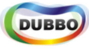

# RPC

### Google gRPC

- https://github.com/grpc/grpc

gRPC 是 google 最新发布的开源 RPC 框架, 声称是"一个高性能，开源，将移动和HTTP/2放在首位的通用的RPC框架.",支持 android 和 iOS. 技术栈非常的新, 基于HTTP/2, netty4.1, proto3, 拥有非常丰富而实用的特性, 堪称新一代 RPC 框架的典范.

这个项目开始于2015年2月，1.0正式版本正式发布于2016年8月，已经可以用于生产环境了。

> 注： 这是我个人最喜欢的一个 RPC 框架，推崇备至。这里有一份我的 [gRPC的学习笔记](http://skyao.gitbooks.io/leaning-grpc)，有兴趣的同学可以过去看看

### Apache Thrift

- http://thrift.apache.org/

Thrift 源于 facebook，在2007年捐献给 Apache, 目前最新版本 0.9.3 (发布于 2015-10-06)

Thrift 可以算是业界最经典的 RPC 框架之一，效率极高, 使用广泛，成熟稳定。

缺点：

1. 项目似乎不再继续演进，看不到未来的路线图
2. 和 gRPC 相比，缺乏对HTTP/2的支持，缺乏对移动设备的支持
3. 底层通讯机制不足够理想：唯品会的OSP框架干脆就直接放弃 thrift 底层通讯直接用 netty4 重写

### Hessian/Hessian2

- http://hessian.caucho.com/

基于HTTP协议传输的二进制 web service 方案，由 caucho 公司提供（他们家还出产 Resin ，一个曾经很不错的 web container）。

缺点：

1. 效率和 thrift / gRPC 等相比较差，甚至不如REST风格的Jackson
2. 基本停止发展，最后一个大版本 4.0.* 发布于2009年，之后只有bugfix版本
3. 以今天的眼光看 hession 的特性，只能说陈旧

不过由于历史原因，还是有不少框架在使用 hessian，比如 dubbo 默认采用 hessian2 序列化，微博新开源的 Motan 框架也是用的 hession 4.0.38。

### Dubbo 协议

阿里在 Dubbo 中实现了基于 TCP 的 RPC 协议，名字也就简单的叫做 Dubbo 协议(当然 Dubbo 框架也支持其他协议如hession2/thrift/RMI/WebService)。当时的目标是希望开发一个高效的java序列化实现，但是为开发成熟，一度不建议在生产环境使用它。后来 dubbo 自生停止发展了，这个 Dubbo 协议也自然废弃。

建议：没有特殊情况，不要使用。

## 总结

个人意见，选择 RPC 框架时：

1. 追新的同学请选择 gRPC
2. 求稳的同学请选择 thrift
3. 怀旧的同学请选择 hessian2

强调：如果想要高效率，支持 HTTP/2,支持 android 和 iOS，实现高效率的服务器端主动推送，gRPC 是目前唯一的选择。

