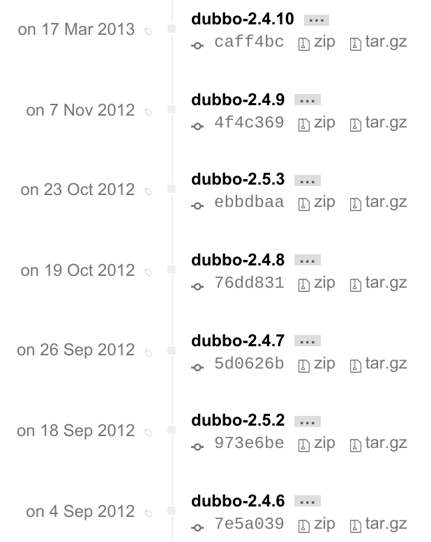
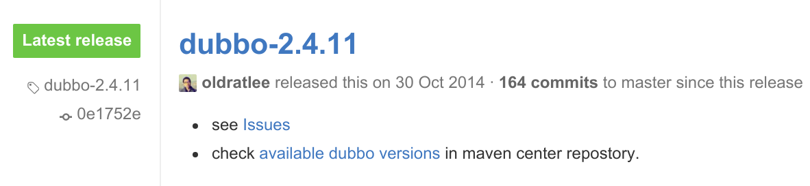
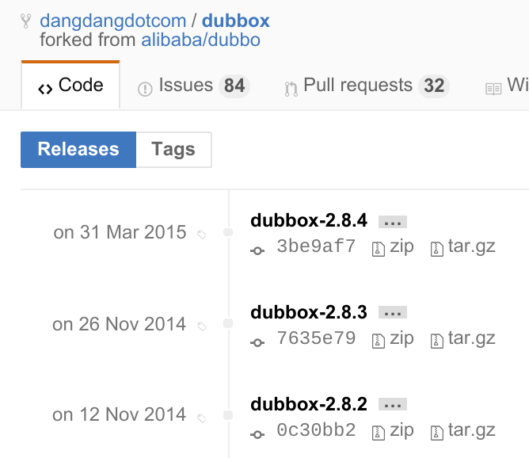

# dubbo

## 介绍

"DUBBO是一个分布式服务框架，致力于提供高性能和透明化的RPC远程服务调用方案，是阿里巴巴SOA服务化治理方案的核心框架，每天为2,000+个服务提供3,000,000,000+次访问量支持，并被广泛应用于阿里巴巴集团的各成员站点。"

> 注： 这是来自 dubbo 官方的介绍，一个令人叹息的历史。

dobbo的一些资料：

- [官网 dubbo.io/](http://dubbo.io/)
- [dubbo源码 @ github](https://github.com/alibaba/dubbo)
- [dubbo的微博](http://weibo.com/dubbo)

## 分析

### 发展现状

dubbo 可以说是国内 SOA 框架（也可以拿来做微服务框架） 的集大成之作，使用者众，影响力大。

但是，目前处境非常不好，在被阿里放弃之后 dubbo 项目接近废弃。

1. 阿里放弃了 dubbo

	原阿里的 dobbo 开发团队已经解散，合并到 HSF，阿里也停止对 dubbo 的支持和后续更新。

    阿里内部改为使用 HSF 框架，彻底断了 dubbo 在阿里和淘宝的路。

    看到有评价，有些为 dubbo 可惜：

    - "我觉得不是hsf更好，hsf在设计上和淘宝的遗留的项目接合的比较紧密。没有必要在迁移到dubbo上对原有的系统进行整改，并且加大风险。"
    - HSF的缺点是其要使用指定的JBoss等容器，还需要在JBoss等容器中加入sar包扩展，对用户运行环境的侵入性大，如果你要运行在Weblogic或Websphere等其它容器上，需要自行扩展容器以兼容HSF的ClassLoader加载。"

2. dubbo 项目在2012年底之后基本就不再继续开发，后续也只有极少量的更新。

	2012年是 dubbo 频繁发布的一年，如火如荼，然后2013年就嘎然而止，就此沉沦：

	

	2014年最后一次发布，只有少量bugfix：

	

3. 当当 fork 并推出了 dubbox

	https://github.com/dangdangdotcom/dubbox

	DubboX 是基于 Dubbo 框架开发的 RPC 框架，支持 REST 风格远程调用，并增加了一些新的 feature

	"dubbox和dubbo 2.x是兼容的，没有改变dubbo的任何已有的功能和配置方式（除了升级了Spring之类的版本）"

	DubboX 陆续有一些版本发布，但是基本都只是简单修复，后续没有任何功能性的发展计划：

	

从目前看，基本看不到 dubbo 有任何死灰复燃的可能性。

## 总结

1. 非常好的一个 SOA 框架，极富研究价值，即便是在废弃多年的今天
2. 如果当年能一直发展下来......
3. 可惜，没有如果，dubbo 已死，请谨慎在生产上使用

> 注：个人对 dubbo 停止发展深表遗憾，这个项目本来可以成为一个伟大的项目，尤其在2015年微服务和 docker 盛行之后，本可以有更大的发挥空间。

